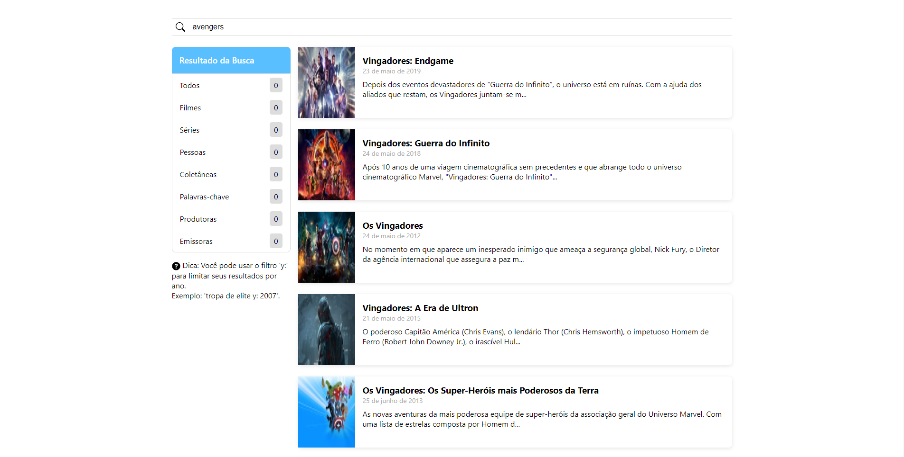

# Front end Challenge Kolabs



## Tecnologias e ferramentas usadas

- React
- NextJs
- Typescript
- Styled-components
- Axios
- React-paginate
- Eslint
- Prettier
- Husky
- Lint-staged

## Como rodar o projeto

Para rodar o projeto clone esse repositório no seu terminal e em seguida mova-se para a pasta do repositório, feito isso instale as dependências do projeto com o comando

```
npm install
```
ou
```
yarn
```

após a instalação das dependências rode o projeto com o comando
```
npm run dev
```
ou
```
yarn dev
```

Em seguida digite a seguinte url no seu navegador:

```
http://localhost:3000
```

---
made by Washington Campos ❤️.
